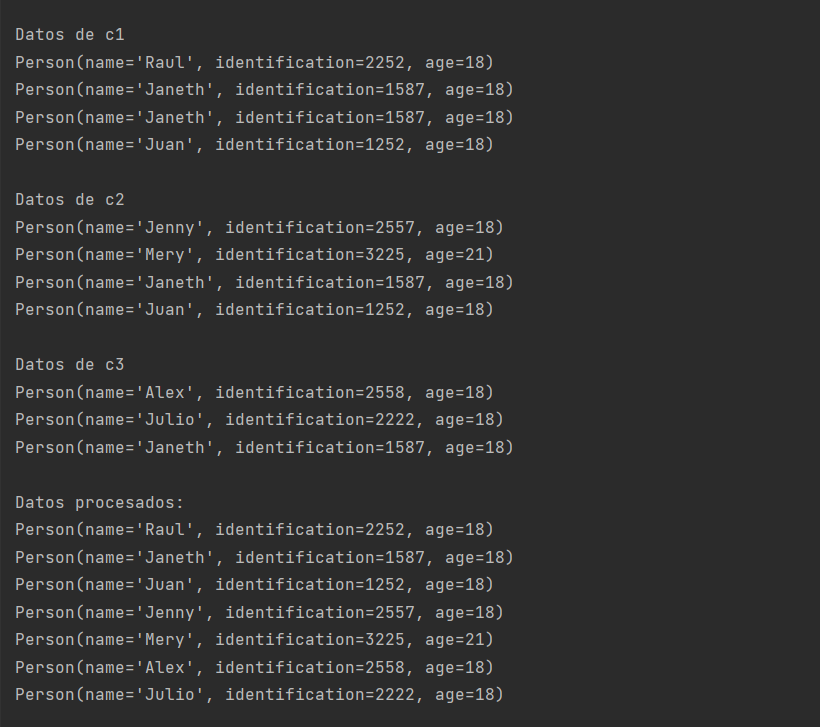
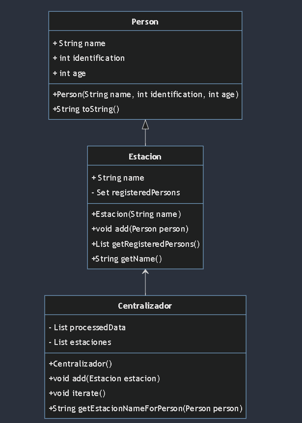

# Identificación de Duplicados en Estaciones Biometricas
Este programa implementa un sistema para identificar personas duplicadas en diferentes estaciones biométricas. Cada estación tiene su propia lista de personas registradas, y el programa centraliza estos datos para eliminar duplicados y mostrar los datos procesados.

## REQUISITOS

java 19 instalada para su ejecucion SDK: (corretto 19)

# Descripción del Programa
El programa consta de tres clases principales:

### **_Person_**: Representa una persona con sus atributos de nombre, identificación y edad. Esta clase implementa un constructor y métodos para obtener los valores de los atributos.

### **_Estacion_**: Representa una estación biométrica con una lista de personas registradas. Esta clase cuenta con un constructor que recibe el nombre de la estación y métodos para agregar personas a la lista y obtener la lista de personas registradas.

### **_Centralizador_**: Esta clase es la encargada de centralizar los datos de todas las estaciones, eliminar duplicados y mostrar los datos procesados. Cuenta con un constructor y métodos para agregar estaciones, iterar sobre los datos y mostrar la información procesada.

# Ejemplo de Uso
        
        public class Main {
        public static void main(String[] args) {
        Estacion c1 = new Estacion("c1");
        c1.add(new Person("Juan", 1252, 18));
        c1.add(new Person("Raul", 2252, 18));
        c1.add(new Person("Janeth", 1587, 18));
        c1.add(new Person("Janeth", 1587, 18));
        
                Estacion c2 = new Estacion("c2");
                c2.add(new Person("Juan", 1252, 18));
                c2.add(new Person("Mery", 3225, 21));
                c2.add(new Person("Jenny", 2557, 18));
                c2.add(new Person("Janeth", 1587, 18));
        
                Estacion c3 = new Estacion("c3");
                c3.add(new Person("Julio", 2222, 18));
                c3.add(new Person("Alex", 2558, 18));
                c3.add(new Person("Janeth", 1587, 18));
        
                Centralizador cent = new Centralizador();
                cent.add(c1);
                cent.add(c2);
                cent.add(c3);
                cent.iterate();
            }
        }
# SALIDA

        Datos de c1
        Person(name='Juan', identification=1252, age=18)
        Person(name='Raul', identification=2252, age=18)
        Person(name='Janeth', identification=1587, age=18)
        
        Datos de c2
        Person(name='Juan', identification=1252, age=18)
        Person(name='Mery', identification=3225, age=21)
        Person(name='Jenny', identification=2557, age=18)
        Person(name='Janeth', identification=1587, age=18)
        
        Datos de c3
        Person(name='Julio', identification=2222, age=18)
        Person(name='Alex', identification=2558, age=18)
        Person(name='Janeth', identification=1587, age=18)
        
        Datos procesados:
        Person(name='Juan', identification=1252, age=18)
        Person(name='Raul', identification=2252, age=18)
        Person(name='Janeth', identification=1587, age=18)
        Person(name='Mery', identification=3225, age=21)
        Person(name='Jenny', identification=2557, age=18)
        Person(name='Julio', identification=2222, age=18)
        Person(name='Alex', identification=2558, age=18)

# EJEMPLO DE EJECUCION:

# DIAGRAMA:

CODIGO MERMAID:

    classDiagram
    class Person {
    + String name
      + int identification
      + int age
      + Person(String name, int identification, int age)
      + String toString()
      }
    
          class Estacion {
              + String name
              - Set<Person> registeredPersons
              + Estacion(String name)
              + void add(Person person)
              + List<Person> getRegisteredPersons()
              + String getName()
          }
    
          class Centralizador {
              - List<Person> processedData
              - List<Estacion> estaciones
              + Centralizador()
              + void add(Estacion estacion)
              + void iterate()
              + String getEstacionNameForPerson(Person person)
          }
    
          Person <|-- Estacion
          Estacion <-- Centralizador

# AUTOR [CARLOS G]
GITHUB: @CARLOSGRCIAGRCIA